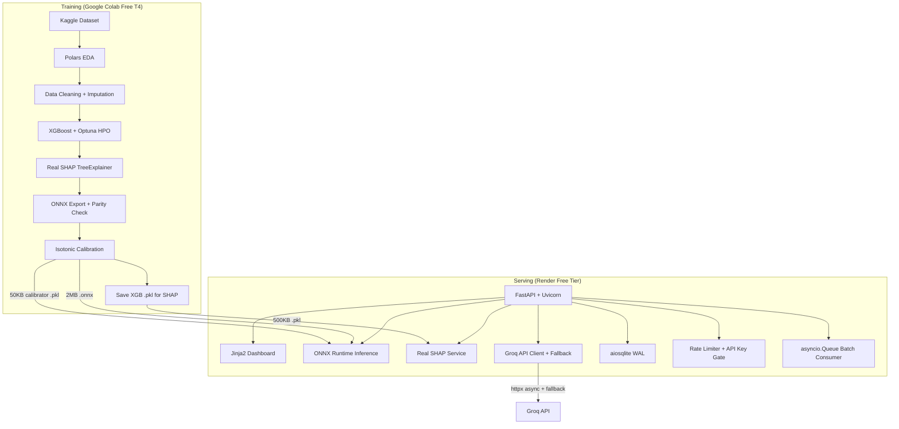

# System Architecture

## Model Performance (Hold-out Test Set)

| Metric | Value | Notes |
|--------|-------|-------|
| F1 Score (Fatal class) | ~0.47 | Imbalanced — 15.4% fatals |
| ROC-AUC | ~0.72 | |
| Precision | ~0.38 | |
| Recall | ~0.62 | High recall intentional — missing a fatal is worse |
| Decision Threshold | 0.18 | F1-optimal on calibration holdout |
| Base Rate (fatals) | 15.4% | Raw XGB uncalibrated ~0.52 → calibrated ~0.20 |

> These are post-calibration metrics on Delhi geographic holdout (unseen state during training).
> F1 ~0.47 is expected and honest — Indian FIR data has 15–30% missing values and weak features.
> The value is in SHAP explainability and intervention simulation, not raw accuracy.

---

## ASCII Diagram

```
┌─────────────────────────────────────────────────────────────────────────────┐
│                         CLOUD (Free Tier)                                   │
│                                                                             │
│   ┌──────────────┐        ┌─────────────────────────┐                      │
│   │ Google Colab │        │     Groq API            │                      │
│   │  (T4 GPU)    │        │  (llama-3-70b, free)    │                      │
│   │              │        │  1M tokens/day          │                      │
│   │ • EDA        │        │                         │                      │
│   │ • XGBoost    │        │ • SHAP → plain English  │                      │
│   │ • Optuna     │        │ • Policy recommendation │                      │
│   │ • SHAP       │        │                         │                      │
│   │ • ONNX Export│        └─────────────────────────┘                      │
│   └──────┬───────┘                  ▲                                      │
│          │ download (2MB .onnx)      │ async httpx (10s timeout, fallback) │
└──────────┼───────────────────────────┼─────────────────────────────────────┘
           │                           │
           ▼                           │
┌─────────────────────────────────────────────────────────────────────────────┐
│                      RENDER FREE TIER (Single Container)                    │
│                                                                             │
│  Browser / Postman                                                          │
│       │                                                                     │
│       ▼                                                                     │
│  ┌──────────────────────────────────────────────────────┐                   │
│  │              FastAPI (uvicorn) :8000                 │                   │
│  │                                                      │                   │
│  │  ├── GET  /              ← HTML Dashboard (Jinja2)   │                   │
│  │  ├── GET  /docs          ← Swagger UI (auto)         │                   │
│  │  ├── POST /v1/predict    ← Prediction + Real SHAP    │                   │
│  │  ├── POST /v1/counterfactual ← What-if simulator     │                   │
│  │  ├── POST /v1/explain    ← Groq LLM + Fallback       │                   │
│  │  ├── POST /v1/batch-predict ← Async batch (Queue)    │                   │
│  │  ├── GET  /v1/tasks/{id} ← Batch status polling      │                   │
│  │  ├── GET  /v1/incidents  ← Paginated history         │                   │
│  │  ├── GET  /v1/model/metrics ← Real registry metrics  │                   │
│  │  ├── GET  /v1/model/drift   ← Encoded KS-test        │                   │
│  │  └── GET  /v1/health     ← DB + ONNX verification    │                   │
│  │                                                      │                   │
│  │  SQLite (WAL mode) ← ./data/soochak.db (ephemeral)   │                   │
│  │  ONNX Runtime ← 2MB model in memory                  │                   │
│  │  XGBoost Model ← TreeExplainer for real SHAP         │                   │
│  │  In-memory cache ← SHA256 dict + TTL 300s            │                   │
│  │  asyncio.Queue ← Lifespan background consumer        │                   │
│  │                                                      │                   │
│  └──────────────────────────────────────────────────────┘                   │
│                                                                             │
└─────────────────────────────────────────────────────────────────────────────┘
```

## Mermaid Diagram


